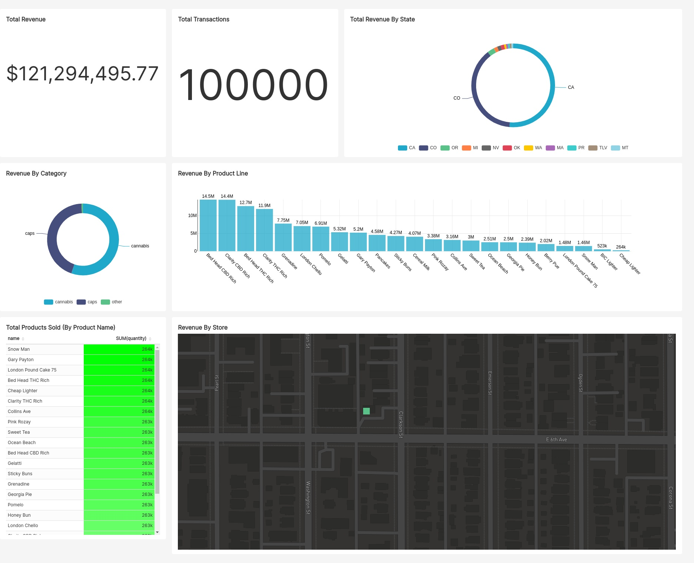

[![MIT License][license-shield]][license-url]
[![LinkedIn][linkedin-shield]][linkedin-url]

## Cookies Demo Project

### About
This is a quick demo project I made for the Cookies team to show my data engineering skills.
<li><a href="#Data Ingestion">Data Ingestion</a></li>
<li><a href="#Data Visualization">Data Visualization</a></li>

### Built With
* [Apache Superset](https://superset.apache.org/)
* [SQLModel](https://sqlmodel.tiangolo.com/)
* [Pydantic](https://github.com/samuelcolvin/pydantic)

### Special Thanks
Thanks to [Preset.io](https://preset.io) for providing a free hosted instance of Apache Superset and [Cockroach Labs](https://www.cockroachlabs.com/) for providing a free hosted instance of CockroachDB to make the live version of this demo possible!

## Data Ingestion
To show off data ingestion I have I have downloaded the Cookies store data from [here](https://www.cookies.com/api/stores) and scraped some of the products from the cookies store website. Unfortunately, I could not find any sales data so I have randomly generates 100000 transactions worth of sales data. You can see the functions used to scrape and generate the data in [etl/sales.py](etl/sales.py). The data is modelled using SQLModel. I have 4 tables in the database: stores, products, transactions, and line items(sales).

## Data Visualization
To show off data visualization I have used a [Superset](https://superset.apache.org/) dashboard to visualize the data. You can see the dashboard on [Preset.io](https://1e9e83ed.us2a.app.preset.io:443/r/1) or [here](img/cookies-dashboard.jpg). In order to make some of the visualizations I normalized the data by joining the 4 tables together and saved that table as a virtual dataset in Superset.

<!-- MARKDOWN LINKS & IMAGES -->
<!-- https://www.markdownguide.org/basic-syntax/#reference-style-links -->
[license-shield]: https://img.shields.io/github/license/othneildrew/Best-README-Template.svg?style=for-the-badge
[license-url]: https://github.com/othneildrew/Best-README-Template/blob/master/LICENSE.txt
[linkedin-shield]: https://img.shields.io/badge/-LinkedIn-black.svg?style=for-the-badge&logo=linkedin&colorB=555
[linkedin-url]: https://www.linkedin.com/in/zachary-braun-b53a68151/
[product-screenshot]: images/screenshot.png
